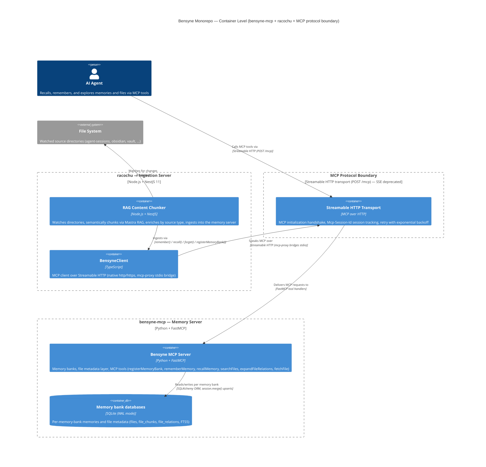

# Container: Bensyne Monorepo — System Container (bensyne-mcp + racochu)

Whole-system container view spanning both apps and the MCP protocol boundary between them. Rendered as PNG (diagram validation uses `format: "png"` — never SVG).

## Diagram

## Elements

| ID | Name | Type | Technology | Description |
|----|------|------|-----------|-------------|
| `agent` | AI Agent | Person | — | Consumes memories and files through MCP tools |
| `chunker` | RAG Content Chunker | Container | Node.js + NestJS 11 | racochu server: watches sources, chunks via Mastra RAG, enriches, ingests |
| `bensyneclient` | BensyneClient | Component | TypeScript | racochu's MCP client — Streamable HTTP, native `http`/`https`, mcp-proxy bridge |
| `mcptransport` | Streamable HTTP Transport | Container | MCP over HTTP | The protocol boundary — handshake, session tracking, retry; SSE deprecated |
| `server` | Bensyne MCP Server | Container | Python + FastMCP | Memory bank + file metadata server exposing the MCP tools |
| `banks` | Memory bank databases | ContainerDb | SQLite (WAL) | Per-bank storage for memories and file metadata |
| `filesystem` | File System | System_Ext | — | Watched source directories defined in racochu config |

## Notes

- **Transport:** Streamable HTTP is the only supported remote transport across the MCP boundary — SSE was deprecated due to init handshake races (see `memories/0001-mcp-transport-sse-deprecated.memory.md`); mcp-proxy bridges stdio→HTTP where needed (e.g. e2e tests).
- **Protocol decisions:** memory bank registration (DEC-0001), bank parameter enforcement (DEC-0002), and in-memory bank registry (DEC-0003) live at the vault root `decisions/` area.
- **Ephemeral racochu side:** no durable database on the racochu side — all state is stored in bensyne-mcp's per-bank SQLite databases.
- **Per-system detail:** see `architectures/racochu/` (component level) and `architectures/bensyne-mcp/`.
