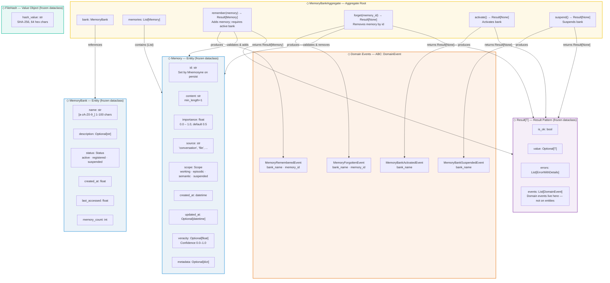

# Bensyne — Memory Domain Model & Entity Schema

## Diagram

## Entity Schema Reference

### MemoryBankAggregate (Aggregate Root)

| Field | Type | Description |
|-------|------|-------------|
| `bank` | `MemoryBank` | Reference to the bank entity |
| `memories` | `List[Memory]` | Collection of memory entities in this bank |

**Operations:**
- `remember(memory: Memory) -> Result[Memory]` — adds memory; rejects if bank not active; produces `MemoryRememberedEvent`
- `forget(memory_id: str) -> Result[None]` — removes memory; rejects if not found; produces `MemoryForgottenEvent`
- `activate() -> Result[None]` — transitions status to active; produces `MemoryBankActivatedEvent`
- `suspend() -> Result[None]` — transitions status to suspended; produces `MemoryBankSuspendedEvent`

### MemoryBank (Entity — frozen dataclass)

| Field | Type | Description |
|-------|------|-------------|
| `name` | `str` | Pattern: `[a-zA-Z0-9_]`, 1-100 chars |
| `description` | `Optional[str]` | Optional description |
| `status` | `Status` | Enum: `active` \| `registered` \| `suspended` |
| `created_at` | `float` | Unix timestamp |
| `last_accessed` | `float` | Unix timestamp |
| `memory_count` | `int` | Number of memories |

**Factory:** `MemoryBank.of(properties) -> Result[MemoryBank]` via `MemoryBankSchema`

### Memory (Entity — frozen dataclass)

| Field | Type | Description |
|-------|------|-------------|
| `id` | `str` | Set by Mnemosyne on persist |
| `content` | `str` | Non-empty (min_length=1) |
| `importance` | `float` | Range: 0.0 – 1.0, default 0.5 |
| `source` | `str` | Origin: 'conversation', 'file', etc. |
| `scope` | `Scope` | Enum: `working` \| `episodic` \| `semantic` \| `suspended` |
| `created_at` | `datetime` | Creation timestamp |
| `updated_at` | `Optional[datetime]` | Last update timestamp |
| `veracity` | `Optional[float]` | Confidence score (0.0–1.0) |
| `metadata` | `Optional[dict]` | Arbitrary metadata |

**Factory:** `Memory.of(properties) -> Result[Memory]` via `MemorySchema`
**Operations:** `update(content, importance) -> Memory` — returns new frozen instance

### FileHash (Value Object — frozen dataclass)

| Field | Type | Description |
|-------|------|-------------|
| `hash_value` | `str` | SHA-256, exactly 64 hex chars |

**Validation:** Regex `^[a-f0-9]{64}$` — standalone value object, not part of any aggregate

### Result[T] (Result Pattern — frozen dataclass)

| Field | Type | Description |
|-------|------|-------------|
| `is_ok` | `bool` | True if success |
| `value` | `Optional[T]` | Success value (None on error) |
| `errors` | `List[ErrorWithDetails]` | Error list (empty on success) |
| `events` | `List[DomainEvent]` | Domain events produced by operation |

**Key rule:** Domain events live in `Result.events`, NOT on entities or aggregates

## Notes

- All domain entities are **frozen dataclasses** — immutable; updates produce new instances
- `MemoryBankAggregate` is the **only boundary** for memory operations — remembers only on active banks
- Domain events split across files: `memory_events.py` (MemoryRememberedEvent, MemoryForgottenEvent), `memory_bank_events.py` (MemoryBankActivatedEvent, MemoryBankSuspendedEvent)
- File metadata domain model documented separately in `architectures/bensyne/0002-file-metadata.code.md`
- All domain operations return `Result[T]` — no exceptions in domain layer
