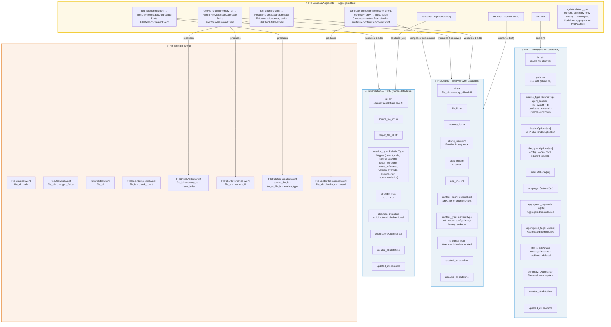

# Bensyne — File Metadata Domain Model

## Diagram

## Entity Schema Reference

### FileMetadataAggregate (Aggregate Root)

| Field | Type | Description |
|-------|------|-------------|
| `file` | `File` | Reference to the file entity |
| `chunks` | `List[FileChunk]` | Collection of chunk entities |
| `relations` | `List[FileRelation]` | Collection of relation entities |

**Operations:**
- `of(file, chunks, relations) -> Result[FileMetadataAggregate]` — factory
- `add_chunk(chunk) -> Result[FileMetadataAggregate]` — enforces memory_id uniqueness, emits `FileChunkAddedEvent`, delegates to `File.with_chunk()`
- `remove_chunk(memory_id) -> Result[FileMetadataAggregate]` — emits `FileChunkRemovedEvent`, delegates to `File.without_chunk()`
- `add_relation(relation) -> Result[FileMetadataAggregate]` — emits `FileRelationCreatedEvent`
- `compose_content(mnemosyne_client: Callable[[str], Optional[dict]], summary_only=False) -> Result[dict]` — composes summary + chunk content, emits `FileContentComposedEvent`
- `to_dict(include_relation_type, include_content, summary_only, mnemosyne_client) -> Result[dict]` — builds MCP output dict

### File (Entity — frozen dataclass)

| Field | Type | Description |
|-------|------|-------------|
| `id` | `str` | Stable file identifier |
| `path` | `str` | File path (absolute) |
| `source_type` | `SourceType` | Enum: `agent_session` \| `file_system` \| `git` \| `database` \| `external` \| `remote` \| `unknown` |
| `hash` | `Optional[str]` | SHA-256 for deduplication |
| `file_type` | `Optional[str]` | config/code/docs (racochu-aligned) |
| `size` | `Optional[int]` | File size in bytes (>= 0) |
| `language` | `Optional[str]` | Programming language |
| `aggregated_keywords` | `List[str]` | Aggregated from chunks |
| `aggregated_tags` | `List[str]` | Aggregated from chunks |
| `status` | `FileStatus` | Enum: `pending` \| `indexed` \| `archived` \| `deleted` |
| `summary` | `Optional[str]` | File-level summary text |
| `created_at` | `datetime` | Creation timestamp |
| `updated_at` | `datetime` | Last update timestamp |

**Factory:** `File.of(properties) -> Result[File]` via `FileSchema`
**Operations:** `mark_indexed()`, `mark_archived()`, `mark_deleted()`, `update_metadata()`, `add_keywords()`, `add_tags()`, `with_chunk()`, `without_chunk()` — all return new frozen instances

### FileChunk (Entity — frozen dataclass)

| Field | Type | Description |
|-------|------|-------------|
| `id` | `str` | Unique id (backfilled `file_id:memory_id`) |
| `file_id` | `str` | Reference to File |
| `memory_id` | `str` | Reference to Memory (in mnemosyne) |
| `chunk_index` | `int` | Position in chunk sequence (0-based) |
| `start_line` | `int` | Starting line in source file (>= 0) |
| `end_line` | `int` | Ending line in source file (>= start_line) |
| `content_hash` | `Optional[str]` | SHA-256 of chunk content |
| `content_type` | `ContentType` | Enum: `text` \| `code` \| `config` \| `image` \| `binary` \| `unknown` |
| `is_partial` | `bool` | True if oversized chunk was truncated |
| `created_at` | `datetime` | Creation timestamp |
| `updated_at` | `datetime` | Last update timestamp |

**Factory:** `FileChunk.of(properties) -> Result[FileChunk]` via `FileChunkSchema`
**Operations:** `update_metadata(content_type, content_hash, is_partial, start_line, end_line)`

### FileRelation (Entity — frozen dataclass)

| Field | Type | Description |
|-------|------|-------------|
| `id` | `str` | Unique id (backfilled `source:target:type`) |
| `source_file_id` | `str` | Source file reference |
| `target_file_id` | `str` | Target file reference (must differ from source) |
| `relation_type` | `RelationType` | 9 types: parent_child, sibling, backlink, folder_hierarchy, cross_reference, version, override, dependency, recommendation |
| `strength` | `float` | Confidence (0.0–1.0), default 1.0 |
| `direction` | `Direction` | unidirectional \| bidirectional |
| `description` | `Optional[str]` | Human-readable explanation |
| `created_at` | `datetime` | Creation timestamp |
| `updated_at` | `datetime` | Last update timestamp |

**Factory:** `FileRelation.of(properties) -> Result[FileRelation]` via `FileRelationSchema`
**Operations:** `update_strength(strength)`, `update_description(description)`

## Repository & Storage Notes

- **Storage:** per-bank `file_metadata.db` via `FileMetadataConnectionManager` — SQLAlchemy Engine/Session, WAL mode, connection pool (default 5)
- **Migrations:** custom runner (`file_metadata_migrations.py`), versions V1–V5:
  - V1 — initial: files, file_chunks, file_relations + indexes
  - V2 — files: file_type, size, language, status + FTS5 (trigram) virtual table `files_fts` + sync triggers
  - V3 — file_chunks: id, content_hash, content_type, is_partial, updated_at + unique index + backfill
  - V4 — file_relations: id, strength, direction, description, updated_at + unique index + backfill
  - V5 — files: summary column
- **Repositories:** concrete SQLAlchemy ORM classes (no interfaces):
  - `FileRepository` — save (session.merge upsert), get_by_id, get_by_path, list, FTS5 search, delete
  - `FileChunkRepository` — save, get_chunks_by_file_id, get_chunk_by_memory_id, delete_chunk
  - `FileRelationRepository` — save, get_relations_by_file_id
- **ORM models:** `FileORM` (cascade chunks + relations), `FileChunkORM` (PK file_id+memory_id), `FileRelationORM` (PK source+target+type)

## Notes

- All file domain entities are **frozen dataclasses** — immutable; updates produce new instances
- `FileMetadataAggregate` is the **only boundary** for file metadata operations — chunk uniqueness enforced here
- Content composition is **aggregate-owned** (`compose_content()` / `to_dict()`) — use cases delegate, not build dicts
- Content is **NOT stored** in FileChunk — it exists in mnemosyne (the Memory); FileChunk stores only metadata + content_hash
- `section_header` exists as a DB column (V1) but is NOT on the FileChunk entity
- FileService: create_file, update_file, delete_file, link_chunk, create_relation, get_file, upsert_file, find_files_by_memory, remove_chunk, get_chunks_count_by_file_id
- File lifecycle: `pending → indexed → archived`; `deleted` is terminal
