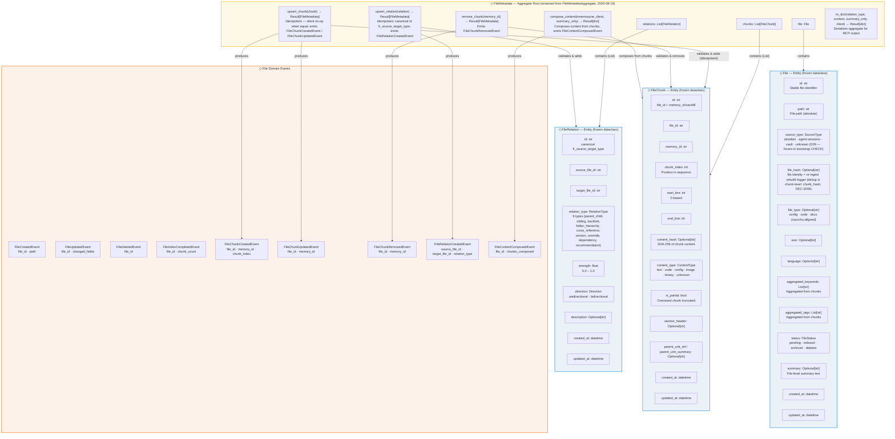

# Bensyne — File Metadata Domain Model

## Diagram

## Entity Schema Reference

### FileMetadata (Aggregate Root — renamed from FileMetadataAggregate, 2026-08-18)

| Field | Type | Description |
|-------|------|-------------|
| `file` | `File` | Reference to the file entity |
| `chunks` | `List[FileChunk]` | Collection of chunk entities |
| `relations` | `List[FileRelation]` | Collection of relation entities |

**Operations:**
- `of(file, chunks, relations) -> Result[FileMetadata]` — factory
- `upsert_chunk(chunk) -> Result[FileMetadata]` — idempotent (no chunk for `memory_id` → add; different `chunk_index` → replace; differing fields → in-place update; equal → silent no-op); emits `FileChunkCreatedEvent` / `FileChunkUpdatedEvent` per change, delegates to `File.with_chunk()`
- `remove_chunk(memory_id) -> Result[FileMetadata]` — emits `FileChunkRemovedEvent`, delegates to `File.without_chunk()`
- `upsert_relation(relation) -> Result[FileMetadata]` — idempotent; dedup key `(target_file_id, relation_type)` scoped to the aggregate's file as source; canonical id `fr_{source}_{target}_{type}`; emits `FileRelationCreatedEvent`
- `compose_content(mnemosyne_client: Callable[[str], Optional[dict]], summary_only=False) -> Result[dict]` — composes summary + chunk content, emits `FileContentComposedEvent`
- `to_dict(include_relation_type, include_content, summary_only, mnemosyne_client) -> Result[dict]` — builds MCP output dict

### File (Entity — frozen dataclass)

| Field | Type | Description |
|-------|------|-------------|
| `id` | `str` | Stable file identifier |
| `path` | `str` | File path (absolute) |
| `source_type` | `SourceType` | Enum (D29): `obsidian` \| `agent-sessions` \| `vault` \| `unknown` — frozen in bootstrap CHECK |
| `file_hash` | `Optional[str]` | file identity + re-ingest rebuild trigger (dedup is chunk-level: `chunk_hash`, DEC-0048) |
| `file_type` | `Optional[str]` | config/code/docs (racochu-aligned) |
| `size` | `Optional[int]` | File size in bytes (>= 0) |
| `language` | `Optional[str]` | Programming language |
| `aggregated_keywords` | `List[str]` | Aggregated from chunks |
| `aggregated_tags` | `List[str]` | Aggregated from chunks |
| `status` | `FileStatus` | Enum: `pending` \| `indexed` \| `archived` \| `deleted` |
| `summary` | `Optional[str]` | File-level summary text |
| `created_at` | `datetime` | Creation timestamp |
| `updated_at` | `datetime` | Last update timestamp |

**Factory:** `File.of(properties) -> Result[File]` via `FileSchema`
**Operations:** `mark_indexed()`, `mark_archived()`, `mark_deleted()`, `update_metadata()`, `add_keywords()`, `add_tags()`, `with_chunk()`, `without_chunk()` — all return new frozen instances

### FileChunk (Entity — frozen dataclass)

| Field | Type | Description |
|-------|------|-------------|
| `id` | `str` | Unique id (backfilled `file_id:memory_id`) |
| `file_id` | `str` | Reference to File |
| `memory_id` | `str` | Reference to Memory (in mnemosyne) |
| `chunk_index` | `int` | Position in chunk sequence (0-based) |
| `start_line` | `int` | Starting line in source file (>= 0) |
| `end_line` | `int` | Ending line in source file (>= start_line) |
| `content_hash` | `Optional[str]` | SHA-256 of chunk content |
| `content_type` | `ContentType` | Enum: `text` \| `code` \| `config` \| `image` \| `binary` \| `unknown` |
| `is_partial` | `bool` | True if oversized chunk was truncated |
| `section_header` | `Optional[str]` | Section header for this chunk (V6, on entity since 2026-08) |
| `parent_unit_ref` | `Optional[str]` | Reference to the parent processing unit (V6) |
| `parent_unit_summary` | `Optional[str]` | Summary of the parent processing unit (V6) |
| `created_at` | `datetime` | Creation timestamp |
| `updated_at` | `datetime` | Last update timestamp |

**Factory:** `FileChunk.of(properties) -> Result[FileChunk]` via `FileChunkSchema`
**Operations:** `update_metadata(content_type, content_hash, is_partial, start_line, end_line)`

### FileRelation (Entity — frozen dataclass)

| Field | Type | Description |
|-------|------|-------------|
| `id` | `str` | Unique id (backfilled `source:target:type`) |
| `source_file_id` | `str` | Source file reference |
| `target_file_id` | `str` | Target file reference (must differ from source) |
| `relation_type` | `RelationType` | 9 types: parent_child, sibling, backlink, folder_hierarchy, cross_reference, version, override, dependency, recommendation |
| `strength` | `float` | Confidence (0.0–1.0), default 1.0 |
| `direction` | `Direction` | unidirectional \| bidirectional |
| `description` | `Optional[str]` | Human-readable explanation |
| `created_at` | `datetime` | Creation timestamp |
| `updated_at` | `datetime` | Last update timestamp |

**Factory:** `FileRelation.of(properties) -> Result[FileRelation]` via `FileRelationSchema`
**Operations:** `update_metadata(strength, description, direction)` — single-call update (replaced per-field `update_strength`/`update_description`)

## Repository & Storage Notes

- **Storage:** per-bank `file_metadata.db` via `FileMetadataConnectionManager` — SQLAlchemy Engine/Session, WAL mode, connection pool (default 5)
- **Migrations:** **single bootstrap migration** (`file_metadata_migrations.py`; legacy V1–V6 collapsed, D28 — byte-identical final schema + schema-snapshot guard; no upgrade path, stale dev DB deleted manually). Final schema includes: files/file_chunks/file_relations + indexes, FTS5 (trigram) `files_fts` + sync triggers, chunk/relation unique indexes, files.summary, file_chunks `section_header`/`parent_unit_ref`/`parent_unit_summary` (V6), source_type CHECK with the D29 value set
- **Repositories:** concrete SQLAlchemy ORM classes (no interfaces):
  - `FileRepository` — save (session.merge upsert), get_by_id, get_by_path, list, FTS5 search, delete
  - `FileChunkRepository` — save, get_chunks_by_file_id, get_chunk_by_memory_id, delete_chunk
  - `FileRelationRepository` — save, get_relations_by_file_id
- **ORM models:** `FileORM` (cascade chunks + relations), `FileChunkORM` (PK file_id+memory_id), `FileRelationORM` (PK source+target+type)

## Notes

- All file domain entities are **frozen dataclasses** — immutable; updates produce new instances
- `FileMetadata` (aggregate root) is the **sole write root** — load aggregate → domain mutation (invariants + events) → single `_persist` chokepoint in `FileService` (D17); idempotent upserts are silent no-ops on equal state
- Content is **NOT stored** in FileChunk — it exists in mnemosyne (the Memory); FileChunk stores only metadata + content_hash
- `section_header` / `parent_unit_ref` / `parent_unit_summary` are on the FileChunk entity (bootstrap schema)
- FileService write surface: `materialize_file_context`, `update_file`, `remove_chunk`, `delete_file`, `rebuild_projection` (+ read passthroughs) — dead CRUD universe deleted (D17/D18); per-bank dependencies via DI container factories (D25)
- File lifecycle: `pending → indexed → archived`; `deleted` is a **revivable** tombstone — re-materialization resurrects it (DELETED → INDEXED, fresh rows)
