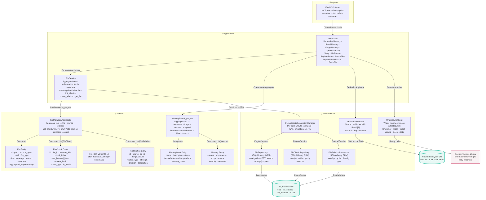

# Bensyne — Component Level (Hexagonal Layers)

## Diagram

## Elements

| ID | Name | Type | Technology | Description |
|----|------|------|-----------|-------------|
| mcp-server | FastMCP Server | Component | FastMCP | MCP protocol entry point — routes tool calls to use cases |
| use-cases | Use Cases | Component | Python | 10 use cases: RememberMemory, RecallMemory, ForgetMemory, UpdateMemory, Sleep, ListBanks, RegisterBank, SearchFiles, ExpandFileRelations, FetchFile |
| file-service | FileService | Component | Python | Application service — aggregate-based orchestration for file CRUD, chunk linking, relations |
| memory-bank-aggregate | MemoryBankAggregate | Component | Python/frozen dataclass | Aggregate root — orchestrates MemoryBank + List[Memory] |
| memory-bank-entity | MemoryBank Entity | Component | Python/frozen dataclass | name, description, status (active/registered/suspended), memory_count |
| memory-entity | Memory Entity | Component | Python/frozen dataclass | content, importance, source, scope, veracity, metadata |
| file-hash-vo | FileHash Value Object | Component | Python/frozen dataclass | hash_value (SHA-256, 64 hex chars) |
| file-metadata-aggregate | FileMetadataAggregate | Component | Python/frozen dataclass | Aggregate root for file metadata — chunks, relations, content composition |
| file-entity | File Entity | Component | Python/frozen dataclass | id, path, source_type, hash, file_type, size, language, status, summary, aggregated_keywords/tags |
| file-chunk-entity | FileChunk Entity | Component | Python/frozen dataclass | id, file_id, memory_id, chunk_index, start/end_line, content_hash, content_type, is_partial |
| file-relation-entity | FileRelation Entity | Component | Python/frozen dataclass | id, source/target_file_id, relation_type, strength, direction, description |
| mnemosyne-client | MnemosyneClient | Component | Python | Infrastructure adapter — wraps mnemosyne-oss with Result[T] |
| hash-index-service | HashIndexService | Component | Python | Infrastructure adapter — wraps HashIndex with Result[T] |
| file-metadata-connection | FileMetadataConnectionManager | Component | Python | Per-bank SQLite connection pool, WAL, migrations V1–V5, SQLAlchemy Engine/Session |
| mnemosyne-lib | mnemosyne-oss Library | Component_Ext | Python | External library — lazy-imported, not a remote service |
| hash-db | HashIndex SQLite DB | ComponentDbExt | SQLite | WAL-mode file hash index |
| file-db | file_metadata.db | ComponentDbExt | SQLite | Per-bank file metadata store with FTS5 |

## Notes

- All domain entities are **frozen dataclasses** (immutable) — updates produce new instances
- Result[T] is the return type for ALL domain operations; domain events live in `Result.events`, not on entities
- `MemoryBankAggregate` is the **only boundary** for memory operations; `FileMetadataAggregate` is the **only boundary** for file metadata operations
- File repositories are **concrete SQLAlchemy ORM classes** (no repository interfaces — collapsed per repo rules)
- `FileRepository.save_file` uses `session.merge()` upsert (avoids INSERT OR REPLACE cascade pitfall)
- `forgetMemory` performs file-chunk cleanup via FileService + chunk repository (only on `pure_memories` banks it is allowed)
