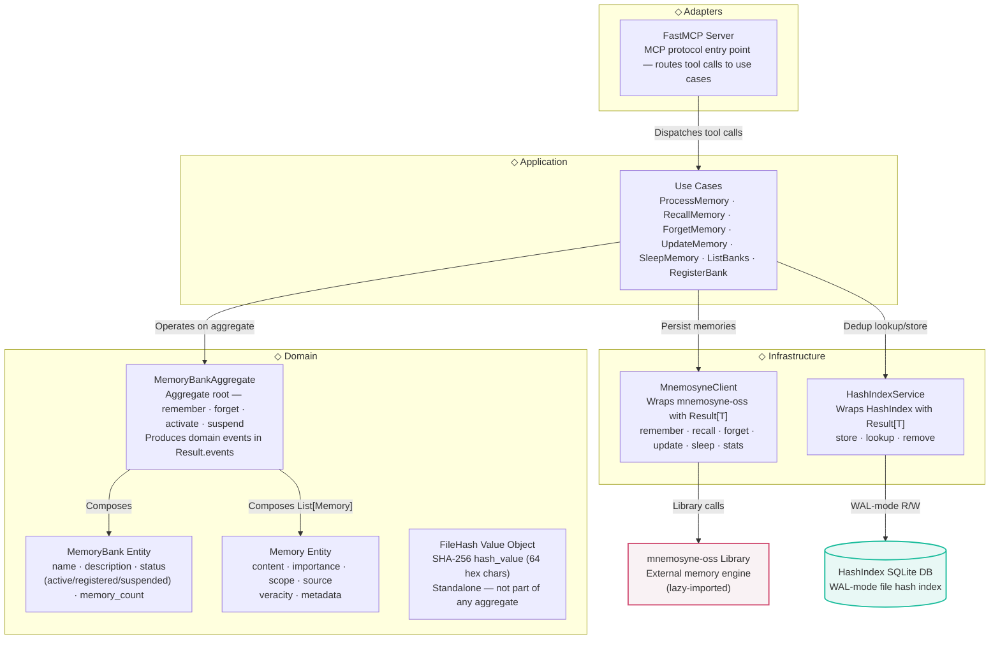

# Bensyne — Component Level (Hexagonal Layers)

## Diagram

## Elements

| ID | Name | Type | Technology | Description |
|----|------|------|-----------|-------------|
| mcp-server | FastMCP Server | Component | FastMCP | MCP protocol entry point — routes tool calls to use cases |
| use-cases | Use Cases | Component | Python | 7 use cases: ProcessMemory, RecallMemory, ForgetMemory, UpdateMemory, SleepMemory, ListBanks, RegisterBank |
| memory-bank-aggregate | MemoryBankAggregate | Component | Python/frozen dataclass | Aggregate root — orchestrates MemoryBank + List[Memory]; remember, forget, activate, suspend; events in Result.events |
| memory-bank-entity | MemoryBank Entity | Component | Python/frozen dataclass | name (str), description (Optional[str]), status (Status: active/registered/suspended), created_at, last_accessed, memory_count |
| memory-entity | Memory Entity | Component | Python/frozen dataclass | content (str), importance (float 0.0-1.0), source (str), scope (Scope: working/episodic/semantic/suspended), created_at, updated_at, veracity, metadata |
| file-hash-vo | FileHash Value Object | Component | Python/frozen dataclass | hash_value (str, SHA-256, 64 hex chars) — standalone value object, not part of any aggregate |
| mnemosyne-client | MnemosyneClient | Component | Python | Infrastructure adapter — wraps mnemosyne-oss with Result[T]; implements IMnemosyneClient interface |
| hash-index-service | HashIndexService | Component | Python | Infrastructure adapter — wraps HashIndex with Result[T]; implements IHashIndexService interface |
| mnemosyne-lib | mnemosyne-oss Library | Component_Ext | Python | External library — lazy-imported, not a remote service |
| hash-db | HashIndex SQLite DB | ComponentDbExt | SQLite | WAL-mode file hash index — maps SHA-256 hashes to memory IDs |

## Notes

- All domain entities are **frozen dataclasses** (immutable) — updates produce new instances
- Result[T] is the return type for ALL domain operations; domain events live in `Result.events`, not on entities
- MemoryBankAggregate is the **only boundary** for memory operations — remembers can only happen on active banks
- Scope values: working, episodic, semantic, suspended — suspend transitions memory scope to "suspended"
- FileHash is a standalone value object, not part of any aggregate
- Pydantic schemas (`MemorySchema`, `MemoryBankSchema`) are used by entity factory methods (`Memory.of()`, `MemoryBank.of()`)
