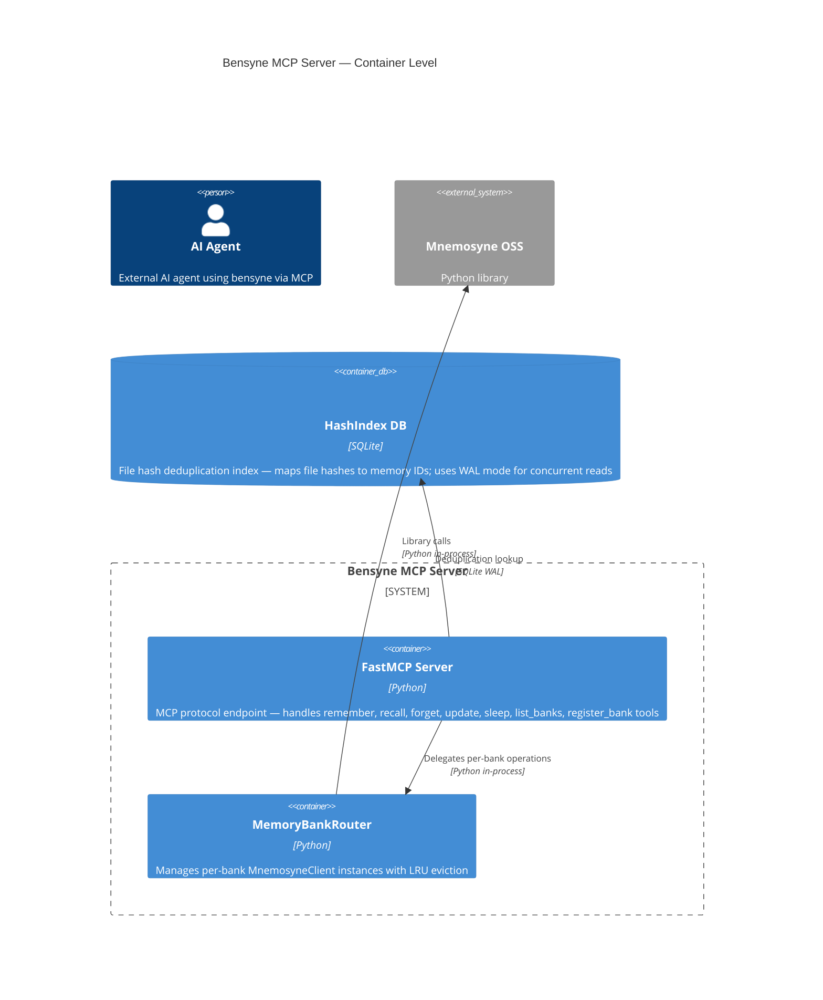

# Bensyne — Container Level

## Diagram

## Elements

| ID | Name | Type | Technology | Description |
|----|------|------|-----------|-------------|
| bensyne-mcp-server | FastMCP Server | Container | Python/FastMCP | MCP protocol endpoint exposing memory operations as tools |
| router | MemoryBankRouter | Container | Python | Per-bank instance pool with LRU eviction and MnemosyneClient management |
| mnemosyne-oss | Mnemosyne OSS | System_Ext | Python library | External memory storage engine (imported as library, not service) |
| hash-index-db | HashIndex DB | ContainerDb | SQLite | File hash deduplication index in WAL mode |

## Notes

- bensyne imports mnemosyne as a Python library (`from mnemosyne import Mnemosyne`), not as a remote service
- HashIndex uses SQLite in WAL mode — allows concurrent reads during writes (verified per [[0004-sqlite-wal-concurrent-reads]])
- MemoryBankRouter maintains a pool of MnemosyneClient instances with LRU eviction
- DDD migration added Result pattern, use cases, and domain layer; MCP tool interfaces preserved for backward compatibility
