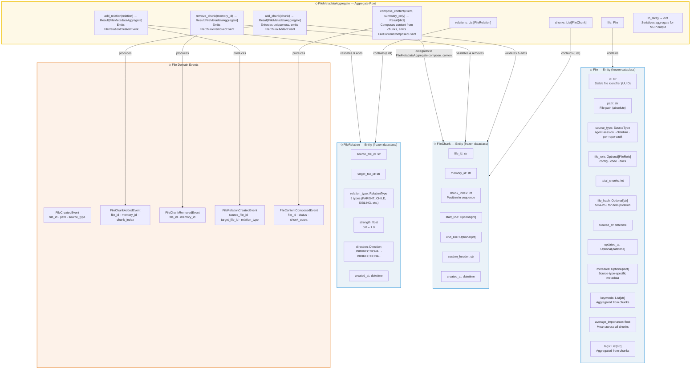

# Bensyne — File Metadata Domain Model

## Diagram

## Entity Schema Reference

### FileMetadataAggregate (Aggregate Root)

| Field | Type | Description |
|-------|------|-------------|
| `file` | `File` | Reference to the file entity |
| `chunks` | `List[FileChunk]` | Collection of chunk entities |
| `relations` | `List[FileRelation]` | Collection of relation entities |

**Operations:**
- `of(file, chunks, relations) -> Result[FileMetadataAggregate]` — factory
- `add_chunk(chunk) -> Result[FileMetadataAggregate]` — enforces uniqueness, emits `FileChunkAddedEvent`, delegates to `File.with_chunk()`
- `remove_chunk(memory_id) -> Result[FileMetadataAggregate]` — emits `FileChunkRemovedEvent`, delegates to `File.without_chunk()`
- `add_relation(relation) -> Result[FileMetadataAggregate]` — emits `FileRelationCreatedEvent`
- `compose_content(mnemosyne_client, summary_only=False) -> Result[dict]` — composes content from chunks, emits `FileContentComposedEvent`
- `to_dict() -> dict` — serializes aggregate for MCP tool output

### File (Entity — frozen dataclass)

| Field | Type | Description |
|-------|------|-------------|
| `id` | `str` | Stable file identifier (UUID) |
| `path` | `str` | File path (absolute) |
| `source_type` | `SourceType` | Enum: `agent-session` \| `obsidian` \| `per-repo-vault` |
| `file_role` | `Optional[FileRole]` | Enum: `config` \| `code` \| `docs` |
| `total_chunks` | `int` | Number of chunks |
| `file_hash` | `Optional[str]` | SHA-256 for deduplication |
| `created_at` | `datetime` | Creation timestamp |
| `updated_at` | `Optional[datetime]` | Last update timestamp |
| `metadata` | `Optional[dict]` | Source-type-specific metadata |
| `keywords` | `List[str]` | Aggregated from chunks |
| `average_importance` | `float` | Mean across all chunks |
| `tags` | `List[str]` | Aggregated from chunks |

**Factory:** `File.of(properties) -> Result[File]` via `FileSchema`
**Operations:** `with_chunk(importance, tags, keywords) -> Result[File]` — updates total_chunks, average_importance, merges keywords/tags; `without_chunk(importance) -> Result[File]` — decrements total_chunks, recomputes average_importance

### FileChunk (Entity — frozen dataclass)

| Field | Type | Description |
|-------|------|-------------|
| `file_id` | `str` | Reference to File |
| `memory_id` | `str` | Reference to Memory (in mnemosyne) |
| `chunk_index` | `int` | Position in chunk sequence (0-based) |
| `start_line` | `Optional[int]` | Starting line in source file |
| `end_line` | `Optional[int]` | Ending line in source file |
| `section_header` | `str` | Ancestor heading |
| `created_at` | `datetime` | Creation timestamp |

**Factory:** `FileChunk.of(properties) -> Result[FileChunk]` via `FileChunkSchema`

### FileRelation (Entity — frozen dataclass)

| Field | Type | Description |
|-------|------|-------------|
| `source_file_id` | `str` | Source file reference |
| `target_file_id` | `str` | Target file reference |
| `relation_type` | `RelationType` | 9 types: PARENT_CHILD, SIBLING, BACKLINK, FOLDER_HIERARCHY, CROSS_REFERENCE, VERSION, OVERRIDE, DEPENDENCY, RECOMMENDATION |
| `strength` | `float` | Confidence (0.0–1.0) |
| `direction` | `Direction` | UNIDIRECTIONAL or BIDIRECTIONAL |
| `created_at` | `datetime` | Creation timestamp |

**Factory:** `FileRelation.of(properties) -> Result[FileRelation]` via `FileRelationSchema`

## Notes

- All file domain entities are **frozen dataclasses** — immutable; updates produce new instances
- `FileMetadataAggregate` is the **only boundary** for file metadata operations — chunk uniqueness enforced here
- Content composition moved to aggregate (`compose_content()`) — use case delegates to aggregate, not builds dict
- Content is **NOT stored** in FileChunk — it exists in mnemosyne (the Memory)
- FileRepository, FileChunkRepository, FileRelationRepository are **collapsed to concrete types** (no interfaces needed)
- 5 domain event types: `FileCreatedEvent`, `FileChunkAddedEvent`, `FileChunkRemovedEvent`, `FileRelationCreatedEvent`, `FileContentComposedEvent`
